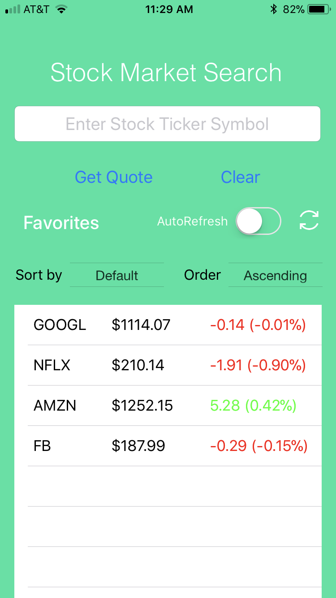
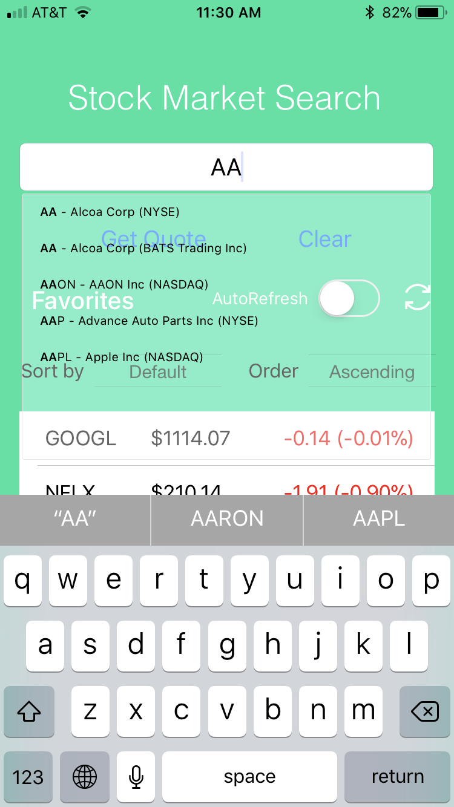
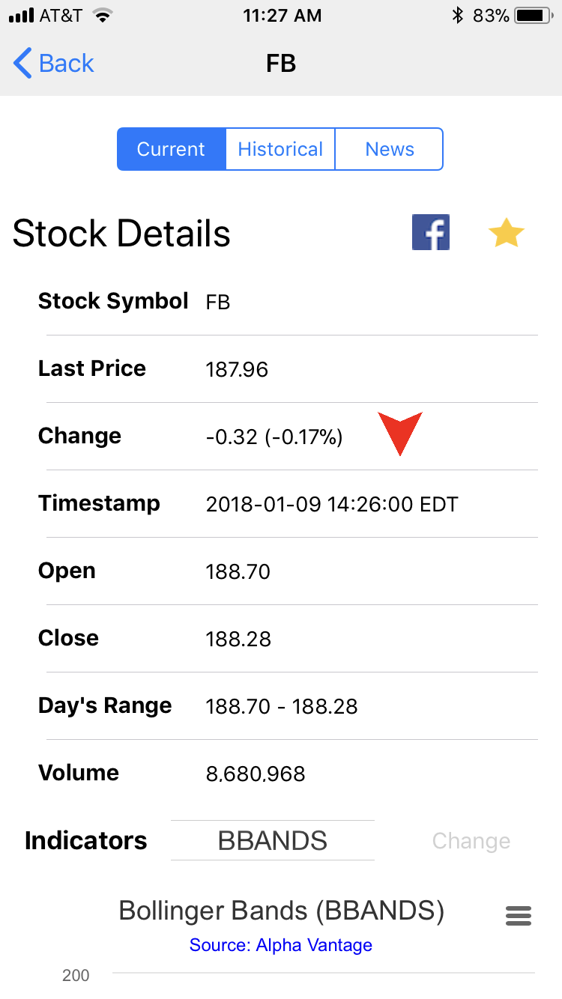
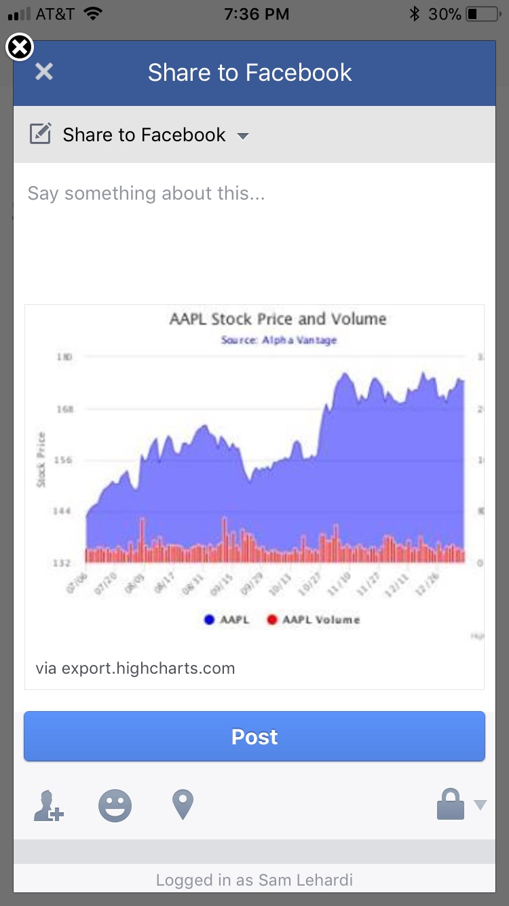
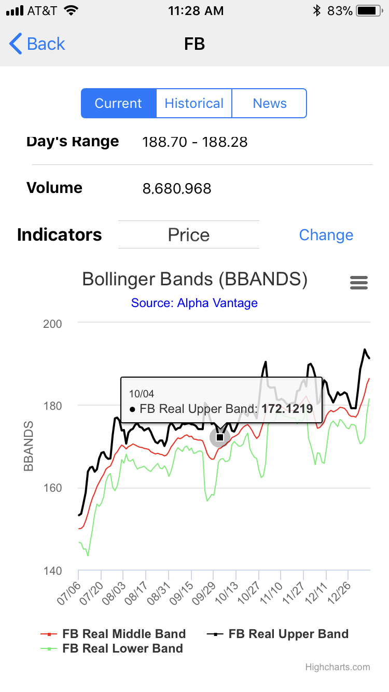
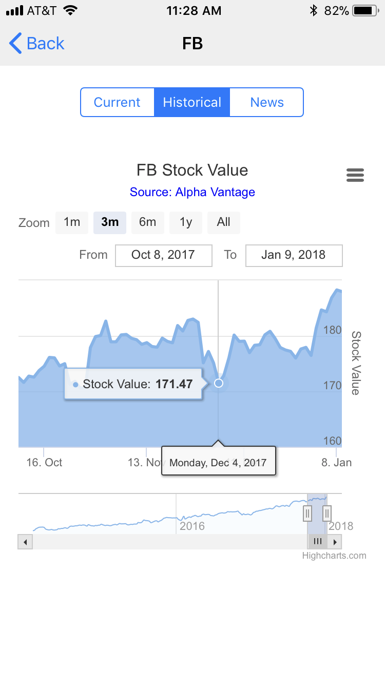
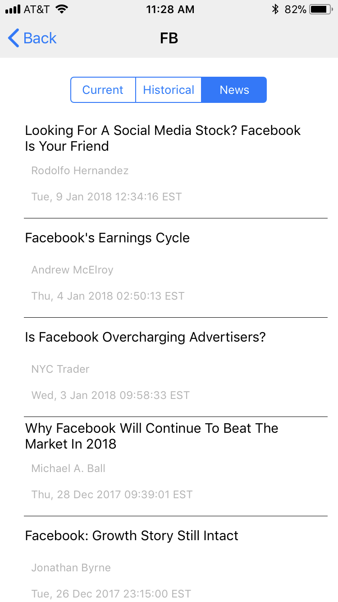

# iOS-Stock-Search
Stock search application using Swift and Xcode and libraries from CocoaPods such as SwiftyJSON, Alamofire, SearchTextField, Easy Toast, and Facebook SDK. Features include displaying interactive stock charts, detailed information, stock news articles, and social networking posting.

## Prerequisites 
Xcode 9 and above is needed to run the application through Mac OS X or iOS sdk for Windows . Mobile Stock folder and separate xcodeproject and xcworkspace are needed to run. Pods can either be also downloaded or separately installed for the application using Pod install. Pods used include Alamofire, EasyToast, FacebookCore/Login/Share, SearchTextField, SwiftSpinner, and SwiftyJSON. 

## Running the application
To run the application, clone or download the necessary files and open the file from the xcworkspace. On Xcode simply build the program and run, preferable device is iPhone 8. 

#### Application Features

The main page on the stock application includes the search textfield with autocomplete features as well as a favorites list with sorting and refreshing capabilities, which is shown below. The favorites list allows deletion of a stock and adding in a stock, which will be discused later in the details page. 

**Initial Page**

Upon beginning to type a stock ticker, an autocomplete feature will appear which lists tickers or stock names containing the letters typed.

**Autocomplete Feature**

After clicking get quote from the initial screen, a loading symbol will appear, and once the data has loaded the stock details will be shown. On this page, there are several features including post to Facebook, add stock to favorites with the star, and view HTML Webview of interactive stock charts fromm 9 different indicators. There is also navigation tabs to switch to view historical charts and news articles.

**Stock Details**

**Facebook Post**

**Stock Chart Indicators**

**Stock Chart Historic**

**Stock News Article**

